# 👾 space-invader 👾

⬛⬛⬛⬛⬛⬛⬛⬛⬛⬛⬛⬛⬛ <br />
⬛⬛⬛🟥⬛⬛⬛⬛⬛🟥⬛⬛⬛ <br />
⬛⬛⬛⬛🟧⬛⬛⬛🟧⬛⬛⬛⬛ <br />
⬛⬛⬛🟨🟨🟨🟨🟨🟨🟨⬛⬛⬛ <br />
⬛⬛🟩🟩⬛🟩🟩🟩⬛🟩🟩⬛⬛ <br />
⬛🟦🟦🟦🟦🟦🟦🟦🟦🟦🟦🟦⬛ <br />
⬛🟪⬛🟪🟪🟪🟪🟪🟪🟪⬛🟪⬛ <br />
⬛🟫⬛🟫⬛⬛⬛⬛⬛🟫⬛🟫⬛ <br />
⬛⬛⬛⬛⬜⬜⬛⬜⬜⬛⬛⬛⬛ <br />
⬛⬛⬛⬛⬛⬛⬛⬛⬛⬛⬛⬛⬛ <br />

```diff
++++++++++++++++++++++++++++++++
+                              +
+        ##          ##        +
+          ##      ##          +
+        ##############        +
+      ####  ######  ####      +
+    ######################    +
+    ##  ##############  ##    +
+    ##  ##          ##  ##    +
+          ####  ####          +
+                              +
++++++++++++++++++++++++++++++++
```

```diff
--------------------------------
-                              -
-        ##          ##        -
-          ##      ##          -
-        ##############        -
-      ####  ######  ####      -
-    ######################    -
-    ##  ##############  ##    -
-    ##  ##          ##  ##    -
-          ####  ####          -
-                              -
--------------------------------
```



```stl
solid Model
facet normal -1 0 0
  outer loop
    vertex -30 70 10.000000000000016
    vertex -30 60 10.000000000000014
    vertex -30 59.99999999999999 20.000000000000014
  endloop
endfacet
facet normal -1 0 0
  outer loop
    vertex -30 70 10.000000000000016
    vertex -30 59.99999999999999 20.000000000000014
    vertex -30 70 20.000000000000014
  endloop
endfacet
facet normal 1 0 0
  outer loop
    vertex -30 49.99999999999999 20.00000000000001
    vertex -30 39.99999999999999 20.000000000000007
    vertex -30 40 10.000000000000009
  endloop
endfacet
facet normal 1 0 0
  outer loop
    vertex -30 49.99999999999999 20.00000000000001
    vertex -30 40 10.000000000000009
    vertex -30 50 10.00000000000001
  endloop
endfacet
facet normal 1 0 0
  outer loop
    vertex -30 19.999999999999996 20.000000000000004
    vertex -30 9.999999999999996 20.000000000000004
    vertex -30 9.999999999999998 10.000000000000002
  endloop
endfacet
facet normal 1 0 0
  outer loop
    vertex -30 19.999999999999996 20.000000000000004
    vertex -30 9.999999999999998 10.000000000000002
    vertex -30 19.999999999999996 10.000000000000004
  endloop
endfacet
facet normal -1 0 0
  outer loop
    vertex -30 9.999999999999998 10.000000000000002
    vertex -30 -2.220446049250313e-15 10
    vertex -30 -4.440892098500626e-15 20
  endloop
endfacet
facet normal -0.9999999999999999 0 0
  outer loop
    vertex -30 9.999999999999998 10.000000000000002
    vertex -30 -4.440892098500626e-15 20
    vertex -30 9.999999999999996 20.000000000000004
  endloop
endfacet
facet normal 0 1 0
  outer loop
    vertex -20 70 10.000000000000016
    vertex -30 70 10.000000000000016
    vertex -30 70 20.000000000000014
  endloop
endfacet
facet normal 0 1 0
  outer loop
    vertex -20 70 10.000000000000016
    vertex -30 70 20.000000000000014
    vertex -20 70 20.000000000000014
  endloop
endfacet
facet normal 0 0 1
  outer loop
    vertex -30 70 20.000000000000014
    vertex -30 59.99999999999999 20.000000000000014
    vertex -20 59.99999999999999 20.000000000000014
  endloop
endfacet
facet normal 0 0 1
  outer loop
    vertex -30 70 20.000000000000014
    vertex -20 59.99999999999999 20.000000000000014
    vertex -20 70 20.000000000000014
  endloop
endfacet
facet normal 0 1.7763568394002506e-16 -1
  outer loop
    vertex -20 70 10.000000000000016
    vertex -20 60 10.000000000000014
    vertex -30 60 10.000000000000014
  endloop
endfacet
facet normal 0 1.7763568394002506e-16 -1
  outer loop
    vertex -20 70 10.000000000000016
    vertex -30 60 10.000000000000014
    vertex -30 70 10.000000000000016
  endloop
endfacet
facet normal 0 -1 -7.105427357601002e-16
  outer loop
    vertex -20 49.99999999999999 20.00000000000001
    vertex -30 49.99999999999999 20.00000000000001
    vertex -30 50 10.00000000000001
  endloop
endfacet
facet normal 0 -1 -7.105427357601002e-16
  outer loop
    vertex -20 49.99999999999999 20.00000000000001
    vertex -30 50 10.00000000000001
    vertex -20 50 10.00000000000001
  endloop
endfacet
facet normal 0 -3.552713678800501e-16 1
  outer loop
    vertex -30 59.99999999999999 20.000000000000014
    vertex -30 49.99999999999999 20.00000000000001
    vertex -20 49.99999999999999 20.00000000000001
  endloop
endfacet
facet normal 0 -3.552713678800501e-16 1
  outer loop
    vertex -30 59.99999999999999 20.000000000000014
    vertex -20 49.99999999999999 20.00000000000001
    vertex -20 59.99999999999999 20.000000000000014
  endloop
endfacet
facet normal 0 3.552713678800501e-16 -1
  outer loop
    vertex -20 60 10.000000000000014
    vertex -20 50 10.00000000000001
    vertex -30 50 10.00000000000001
  endloop
endfacet
facet normal 0 3.552713678800501e-16 -1
  outer loop
    vertex -20 60 10.000000000000014
    vertex -30 50 10.00000000000001
    vertex -30 60 10.000000000000014
  endloop
endfacet
facet normal 0 1 7.105427357601003e-16
  outer loop
    vertex -20 40 10.000000000000009
    vertex -30 40 10.000000000000009
    vertex -30 39.99999999999999 20.000000000000007
  endloop
endfacet
facet normal 0 1 7.105427357601003e-16
  outer loop
    vertex -20 40 10.000000000000009
    vertex -30 39.99999999999999 20.000000000000007
    vertex -20 39.99999999999999 20.000000000000007
  endloop
endfacet
facet normal 0 1 1.77635683940025e-16
  outer loop
    vertex -30 9.999999999999998 10.000000000000002
    vertex -30 9.999999999999996 20.000000000000004
    vertex -10 9.999999999999996 20.000000000000004
  endloop
endfacet
facet normal 0 -1 -2.220446049250313e-16
  outer loop
    vertex -30 -4.440892098500626e-15 20
    vertex -30 -2.220446049250313e-15 10
    vertex -10 -2.220446049250313e-15 10
  endloop
endfacet
facet normal 0 -3.552713678800501e-16 1
  outer loop
    vertex -30 9.999999999999996 20.000000000000004
    vertex -30 -4.440892098500626e-15 20
    vertex -10 9.999999999999996 20.000000000000004
  endloop
endfacet
facet normal 0 1.7763568394002506e-16 -1
  outer loop
    vertex -30 9.999999999999998 10.000000000000002
    vertex -10 -2.220446049250313e-15 10
    vertex -30 -2.220446049250313e-15 10
  endloop
endfacet
facet normal 1 0 0
  outer loop
    vertex 30 80 20.000000000000018
    vertex 30 70 20.000000000000014
    vertex 30 70 10.000000000000016
  endloop
endfacet
facet normal 1 0 0
  outer loop
    vertex 30 80 20.000000000000018
    vertex 30 70 10.000000000000016
    vertex 30 80 10.000000000000018
  endloop
endfacet
facet normal 1 0 0
  outer loop
    vertex 30 59.99999999999999 20.000000000000014
    vertex 30 49.99999999999999 20.00000000000001
    vertex 30 50 10.00000000000001
  endloop
endfacet
facet normal 1 0 0
  outer loop
    vertex 30 59.99999999999999 20.000000000000014
    vertex 30 50 10.00000000000001
    vertex 30 60 10.000000000000014
  endloop
endfacet
facet normal 1 0 0
  outer loop
    vertex 30 9.999999999999998 10.000000000000002
    vertex 30 29.999999999999996 10.000000000000007
    vertex 30 9.999999999999996 20.000000000000004
  endloop
endfacet
facet normal 1 0 0
  outer loop
    vertex 30 29.999999999999996 20.000000000000007
    vertex 30 9.999999999999996 20.000000000000004
    vertex 30 29.999999999999996 10.000000000000007
  endloop
endfacet
facet normal 0 1 0
  outer loop
    vertex 30 80 10.000000000000018
    vertex 20 80 10.000000000000018
    vertex 20 80 20.000000000000018
  endloop
endfacet
facet normal 0 1 0
  outer loop
    vertex 30 80 10.000000000000018
    vertex 20 80 20.000000000000018
    vertex 30 80 20.000000000000018
  endloop
endfacet
facet normal 0 -1 0
  outer loop
    vertex 30 70 20.000000000000014
    vertex 20 70 20.000000000000014
    vertex 20 70 10.000000000000016
  endloop
endfacet
facet normal 0 -1 0
  outer loop
    vertex 30 70 20.000000000000014
    vertex 20 70 10.000000000000016
    vertex 30 70 10.000000000000016
  endloop
endfacet
facet normal 0 -3.552713678800501e-16 1
  outer loop
    vertex 20 80 20.000000000000018
    vertex 20 70 20.000000000000014
    vertex 30 70 20.000000000000014
  endloop
endfacet
facet normal 0 -3.552713678800501e-16 1
  outer loop
    vertex 20 80 20.000000000000018
    vertex 30 70 20.000000000000014
    vertex 30 80 20.000000000000018
  endloop
endfacet
facet normal 0 1.7763568394002506e-16 -1
  outer loop
    vertex 30 80 10.000000000000018
    vertex 30 70 10.000000000000016
    vertex 20 70 10.000000000000016
  endloop
endfacet
facet normal 0 1.7763568394002506e-16 -1
  outer loop
    vertex 30 80 10.000000000000018
    vertex 20 70 10.000000000000016
    vertex 20 80 10.000000000000018
  endloop
endfacet
facet normal 0 1 7.105427357601002e-16
  outer loop
    vertex 30 60 10.000000000000014
    vertex 20 60 10.000000000000014
    vertex 20 59.99999999999999 20.000000000000014
  endloop
endfacet
facet normal 0 1 7.105427357601002e-16
  outer loop
    vertex 30 60 10.000000000000014
    vertex 20 59.99999999999999 20.000000000000014
    vertex 30 59.99999999999999 20.000000000000014
  endloop
endfacet
facet normal 0 -3.552713678800501e-16 1
  outer loop
    vertex 20 59.99999999999999 20.000000000000014
    vertex 20 49.99999999999999 20.00000000000001
    vertex 30 49.99999999999999 20.00000000000001
  endloop
endfacet
facet normal 0 -3.552713678800501e-16 1
  outer loop
    vertex 20 59.99999999999999 20.000000000000014
    vertex 30 49.99999999999999 20.00000000000001
    vertex 30 59.99999999999999 20.000000000000014
  endloop
endfacet
facet normal 0 3.552713678800501e-16 -1
  outer loop
    vertex 30 60 10.000000000000014
    vertex 30 50 10.00000000000001
    vertex 20 50 10.00000000000001
  endloop
endfacet
facet normal 0 3.552713678800501e-16 -1
  outer loop
    vertex 30 60 10.000000000000014
    vertex 20 50 10.00000000000001
    vertex 20 60 10.000000000000014
  endloop
endfacet
facet normal 0 1.7763568394002506e-16 -1
  outer loop
    vertex 30 50 10.00000000000001
    vertex 20 40 10.000000000000009
    vertex 20 50 10.00000000000001
  endloop
endfacet
facet normal -1.77635683940025e-16 -1.7763568394002508e-16 1
  outer loop
    vertex 30 29.999999999999996 20.000000000000007
    vertex 20 39.99999999999999 20.000000000000007
    vertex 20 19.999999999999996 20.000000000000004
  endloop
endfacet
facet normal 0 0 1
  outer loop
    vertex 30 29.999999999999996 20.000000000000007
    vertex 40 39.99999999999999 20.000000000000007
    vertex 20 39.99999999999999 20.000000000000007
  endloop
endfacet
facet normal 8.881784197001258e-17 2.664535259100375e-16 -1
  outer loop
    vertex 20 19.999999999999996 10.000000000000004
    vertex 20 40 10.000000000000009
    vertex 30 29.999999999999996 10.000000000000007
  endloop
endfacet
facet normal 3.155443620884047e-32 1.77635683940025e-16 -1
  outer loop
    vertex 30 50 10.00000000000001
    vertex 30 29.999999999999996 10.000000000000007
    vertex 20 40 10.000000000000009
  endloop
endfacet
facet normal 0 -1 -1.77635683940025e-16
  outer loop
    vertex 30 9.999999999999996 20.000000000000004
    vertex 20 9.999999999999996 20.000000000000004
    vertex 20 9.999999999999998 10.000000000000002
  endloop
endfacet
facet normal 0 -1 -1.77635683940025e-16
  outer loop
    vertex 30 9.999999999999996 20.000000000000004
    vertex 20 9.999999999999998 10.000000000000002
    vertex 30 9.999999999999998 10.000000000000002
  endloop
endfacet
facet normal 0 0 1
  outer loop
    vertex 20 19.999999999999996 20.000000000000004
    vertex 20 9.999999999999996 20.000000000000004
    vertex 30 9.999999999999996 20.000000000000004
  endloop
endfacet
facet normal -1.7763568394002506e-16 -1.7763568394002506e-16 1
  outer loop
    vertex 20 19.999999999999996 20.000000000000004
    vertex 30 9.999999999999996 20.000000000000004
    vertex 30 29.999999999999996 20.000000000000007
  endloop
endfacet
facet normal 0 1.7763568394002508e-16 -1
  outer loop
    vertex 20 9.999999999999998 10.000000000000002
    vertex 20 19.999999999999996 10.000000000000004
    vertex 30 9.999999999999998 10.000000000000002
  endloop
endfacet
facet normal 8.881784197001253e-17 2.6645352591003756e-16 -1
  outer loop
    vertex 30 29.999999999999996 10.000000000000007
    vertex 30 9.999999999999998 10.000000000000002
    vertex 20 19.999999999999996 10.000000000000004
  endloop
endfacet
facet normal -1 0 0
  outer loop
    vertex 20 80 20.000000000000018
    vertex 20 80 10.000000000000018
    vertex 20 70 10.000000000000016
  endloop
endfacet
facet normal -1 0 0
  outer loop
    vertex 20 80 20.000000000000018
    vertex 20 70 10.000000000000016
    vertex 20 70 20.000000000000014
  endloop
endfacet
facet normal 1 0 0
  outer loop
    vertex 20 70 20.000000000000014
    vertex 20 59.99999999999999 20.000000000000014
    vertex 20 60 10.000000000000014
  endloop
endfacet
facet normal 1 0 0
  outer loop
    vertex 20 70 20.000000000000014
    vertex 20 60 10.000000000000014
    vertex 20 70 10.000000000000016
  endloop
endfacet
facet normal -1 0 0
  outer loop
    vertex 20 50 10.00000000000001
    vertex 20 40 10.000000000000009
    vertex 20 39.99999999999999 20.000000000000007
  endloop
endfacet
facet normal -1 0 0
  outer loop
    vertex 20 50 10.00000000000001
    vertex 20 39.99999999999999 20.000000000000007
    vertex 20 49.99999999999999 20.00000000000001
  endloop
endfacet
facet normal -1 0 0
  outer loop
    vertex 20 19.999999999999996 10.000000000000004
    vertex 20 9.999999999999998 10.000000000000002
    vertex 20 9.999999999999996 20.000000000000004
  endloop
endfacet
facet normal -1 0 0
  outer loop
    vertex 20 19.999999999999996 10.000000000000004
    vertex 20 9.999999999999996 20.000000000000004
    vertex 20 19.999999999999996 20.000000000000004
  endloop
endfacet
facet normal 1 0 0
  outer loop
    vertex 20 9.999999999999996 20.000000000000004
    vertex 20 -4.440892098500626e-15 20
    vertex 20 -2.220446049250313e-15 10
  endloop
endfacet
facet normal 1 0 0
  outer loop
    vertex 20 9.999999999999996 20.000000000000004
    vertex 20 -2.220446049250313e-15 10
    vertex 20 9.999999999999998 10.000000000000002
  endloop
endfacet
facet normal 0 1 0
  outer loop
    vertex 20 70 10.000000000000016
    vertex 10 70 10.000000000000016
    vertex 10 70 20.000000000000014
  endloop
endfacet
facet normal 0 1 0
  outer loop
    vertex 20 70 10.000000000000016
    vertex 10 70 20.000000000000014
    vertex 20 70 20.000000000000014
  endloop
endfacet
facet normal 0 0 1
  outer loop
    vertex 10 70 20.000000000000014
    vertex 10 59.99999999999999 20.000000000000014
    vertex 20 59.99999999999999 20.000000000000014
  endloop
endfacet
facet normal 0 0 1
  outer loop
    vertex 10 70 20.000000000000014
    vertex 20 59.99999999999999 20.000000000000014
    vertex 20 70 20.000000000000014
  endloop
endfacet
facet normal 0 1.7763568394002506e-16 -1
  outer loop
    vertex 20 70 10.000000000000016
    vertex 20 60 10.000000000000014
    vertex 10 60 10.000000000000014
  endloop
endfacet
facet normal 0 1.7763568394002506e-16 -1
  outer loop
    vertex 20 70 10.000000000000016
    vertex 10 60 10.000000000000014
    vertex 10 70 10.000000000000016
  endloop
endfacet
facet normal 0 -1 -7.105427357601002e-16
  outer loop
    vertex 20 49.99999999999999 20.00000000000001
    vertex 10 49.99999999999999 20.00000000000001
    vertex 10 50 10.00000000000001
  endloop
endfacet
facet normal 0 -1 -7.105427357601002e-16
  outer loop
    vertex 20 49.99999999999999 20.00000000000001
    vertex 10 50 10.00000000000001
    vertex 20 50 10.00000000000001
  endloop
endfacet
facet normal 0 -3.552713678800501e-16 1
  outer loop
    vertex 10 59.99999999999999 20.000000000000014
    vertex 10 49.99999999999999 20.00000000000001
    vertex 20 49.99999999999999 20.00000000000001
  endloop
endfacet
facet normal 0 -3.552713678800501e-16 1
  outer loop
    vertex 10 59.99999999999999 20.000000000000014
    vertex 20 49.99999999999999 20.00000000000001
    vertex 20 59.99999999999999 20.000000000000014
  endloop
endfacet
facet normal 0 3.552713678800501e-16 -1
  outer loop
    vertex 20 60 10.000000000000014
    vertex 20 50 10.00000000000001
    vertex 10 50 10.00000000000001
  endloop
endfacet
facet normal 0 3.552713678800501e-16 -1
  outer loop
    vertex 20 60 10.000000000000014
    vertex 10 50 10.00000000000001
    vertex 10 60 10.000000000000014
  endloop
endfacet
facet normal 0 1 7.105427357601003e-16
  outer loop
    vertex 20 40 10.000000000000009
    vertex 10 40 10.000000000000009
    vertex 10 39.99999999999999 20.000000000000007
  endloop
endfacet
facet normal 0 1 7.105427357601003e-16
  outer loop
    vertex 20 40 10.000000000000009
    vertex 10 39.99999999999999 20.000000000000007
    vertex 20 39.99999999999999 20.000000000000007
  endloop
endfacet
facet normal 0 -1.7763568394002508e-16 1
  outer loop
    vertex 10 39.99999999999999 20.000000000000007
    vertex 20 19.999999999999996 20.000000000000004
    vertex 20 39.99999999999999 20.000000000000007
  endloop
endfacet
facet normal 0 2.664535259100375e-16 -1
  outer loop
    vertex 20 40 10.000000000000009
    vertex 20 19.999999999999996 10.000000000000004
    vertex 10 40 10.000000000000009
  endloop
endfacet
facet normal 0 -1 -2.220446049250313e-16
  outer loop
    vertex 20 -4.440892098500626e-15 20
    vertex 0 -4.440892098500626e-15 20
    vertex 0 -2.220446049250313e-15 10
  endloop
endfacet
facet normal 0 -1 -2.220446049250313e-16
  outer loop
    vertex 20 -4.440892098500626e-15 20
    vertex 0 -2.220446049250313e-15 10
    vertex 20 -2.220446049250313e-15 10
  endloop
endfacet
facet normal 0 -3.552713678800501e-16 1
  outer loop
    vertex 20 9.999999999999996 20.000000000000004
    vertex 0 -4.440892098500626e-15 20
    vertex 20 -4.440892098500626e-15 20
  endloop
endfacet
facet normal 0 1.7763568394002506e-16 -1
  outer loop
    vertex 20 9.999999999999998 10.000000000000002
    vertex 20 -2.220446049250313e-15 10
    vertex 0 -2.220446049250313e-15 10
  endloop
endfacet
facet normal -1 0 0
  outer loop
    vertex 10 70 20.000000000000014
    vertex 10 70 10.000000000000016
    vertex 10 60 10.000000000000014
  endloop
endfacet
facet normal -1 0 0
  outer loop
    vertex 10 70 20.000000000000014
    vertex 10 60 10.000000000000014
    vertex 10 59.99999999999999 20.000000000000014
  endloop
endfacet
facet normal 1 0 0
  outer loop
    vertex 10 49.99999999999999 20.00000000000001
    vertex 10 39.99999999999999 20.000000000000007
    vertex 10 40 10.000000000000009
  endloop
endfacet
facet normal 1 0 0
  outer loop
    vertex 10 49.99999999999999 20.00000000000001
    vertex 10 40 10.000000000000009
    vertex 10 50 10.00000000000001
  endloop
endfacet
facet normal -1 0 0
  outer loop
    vertex 0 9.999999999999998 10.000000000000002
    vertex 0 -2.220446049250313e-15 10
    vertex 0 -4.440892098500626e-15 20
  endloop
endfacet
facet normal -0.9999999999999999 0 0
  outer loop
    vertex 0 9.999999999999998 10.000000000000002
    vertex 0 -4.440892098500626e-15 20
    vertex 0 9.999999999999996 20.000000000000004
  endloop
endfacet
facet normal 0 1 7.105427357601002e-16
  outer loop
    vertex 10 60 10.000000000000014
    vertex -20 60 10.000000000000014
    vertex 10 59.99999999999999 20.000000000000014
  endloop
endfacet
facet normal 0 -3.552713678800501e-16 1
  outer loop
    vertex 10 59.99999999999999 20.000000000000014
    vertex -20 49.99999999999999 20.00000000000001
    vertex 10 49.99999999999999 20.00000000000001
  endloop
endfacet
facet normal 0 3.552713678800501e-16 -1
  outer loop
    vertex 10 60 10.000000000000014
    vertex 10 50 10.00000000000001
    vertex -20 60 10.000000000000014
  endloop
endfacet
facet normal 0 -3.552713678800501e-16 1
  outer loop
    vertex -20 49.99999999999999 20.00000000000001
    vertex 10 39.99999999999999 20.000000000000007
    vertex 10 49.99999999999999 20.00000000000001
  endloop
endfacet
facet normal 0 1.7763568394002506e-16 -1
  outer loop
    vertex -20 40 10.000000000000009
    vertex 10 50 10.00000000000001
    vertex 10 40 10.000000000000009
  endloop
endfacet
facet normal 0 -1 0
  outer loop
    vertex -30 19.999999999999996 10.000000000000004
    vertex 20 19.999999999999996 10.000000000000004
    vertex 20 19.999999999999996 20.000000000000004
  endloop
endfacet
facet normal 1 0 0
  outer loop
    vertex 50 39.99999999999999 20.000000000000007
    vertex 50 9.999999999999996 20.000000000000004
    vertex 50 9.999999999999998 10.000000000000002
  endloop
endfacet
facet normal 1 0 0
  outer loop
    vertex 50 39.99999999999999 20.000000000000007
    vertex 50 9.999999999999998 10.000000000000002
    vertex 50 40 10.000000000000009
  endloop
endfacet
facet normal 0 1 7.105427357601003e-16
  outer loop
    vertex 50 40 10.000000000000009
    vertex 40 40 10.000000000000009
    vertex 40 39.99999999999999 20.000000000000007
  endloop
endfacet
facet normal 0 1 7.105427357601003e-16
  outer loop
    vertex 50 40 10.000000000000009
    vertex 40 39.99999999999999 20.000000000000007
    vertex 50 39.99999999999999 20.000000000000007
  endloop
endfacet
facet normal 0 0 1
  outer loop
    vertex 40 39.99999999999999 20.000000000000007
    vertex 40 29.999999999999996 20.000000000000007
    vertex 50 39.99999999999999 20.000000000000007
  endloop
endfacet
facet normal 0 1.7763568394002498e-16 -1
  outer loop
    vertex 50 40 10.000000000000009
    vertex 40 29.999999999999996 10.000000000000007
    vertex 40 40 10.000000000000009
  endloop
endfacet
facet normal 1.1842378929335e-16 -1.1842378929335003e-16 1
  outer loop
    vertex 40 29.999999999999996 20.000000000000007
    vertex 50 9.999999999999996 20.000000000000004
    vertex 50 39.99999999999999 20.000000000000007
  endloop
endfacet
facet normal -5.92118946466751e-17 2.3684757858670006e-16 -1
  outer loop
    vertex 50 40 10.000000000000009
    vertex 50 9.999999999999998 10.000000000000002
    vertex 40 29.999999999999996 10.000000000000007
  endloop
endfacet
facet normal 0 -1 -1.77635683940025e-16
  outer loop
    vertex 50 9.999999999999996 20.000000000000004
    vertex 40 9.999999999999996 20.000000000000004
    vertex 40 9.999999999999998 10.000000000000002
  endloop
endfacet
facet normal 0 -1 -1.77635683940025e-16
  outer loop
    vertex 50 9.999999999999996 20.000000000000004
    vertex 40 9.999999999999998 10.000000000000002
    vertex 50 9.999999999999998 10.000000000000002
  endloop
endfacet
facet normal 0 -1.7763568394002506e-16 1
  outer loop
    vertex 40 29.999999999999996 20.000000000000007
    vertex 40 9.999999999999996 20.000000000000004
    vertex 50 9.999999999999996 20.000000000000004
  endloop
endfacet
facet normal 0 2.6645352591003756e-16 -1
  outer loop
    vertex 50 9.999999999999998 10.000000000000002
    vertex 40 9.999999999999998 10.000000000000002
    vertex 40 29.999999999999996 10.000000000000007
  endloop
endfacet
facet normal 1 0 0
  outer loop
    vertex 40 49.99999999999999 20.00000000000001
    vertex 40 39.99999999999999 20.000000000000007
    vertex 40 40 10.000000000000009
  endloop
endfacet
facet normal 1 0 0
  outer loop
    vertex 40 49.99999999999999 20.00000000000001
    vertex 40 40 10.000000000000009
    vertex 40 50 10.00000000000001
  endloop
endfacet
facet normal -1 0 0
  outer loop
    vertex 40 9.999999999999998 10.000000000000002
    vertex 40 9.999999999999996 20.000000000000004
    vertex 40 29.999999999999996 10.000000000000007
  endloop
endfacet
facet normal -1 0 0
  outer loop
    vertex 40 29.999999999999996 20.000000000000007
    vertex 40 29.999999999999996 10.000000000000007
    vertex 40 9.999999999999996 20.000000000000004
  endloop
endfacet
facet normal 0 1 7.105427357601002e-16
  outer loop
    vertex 40 50 10.00000000000001
    vertex 30 50 10.00000000000001
    vertex 30 49.99999999999999 20.00000000000001
  endloop
endfacet
facet normal 0 1 7.105427357601002e-16
  outer loop
    vertex 40 50 10.00000000000001
    vertex 30 49.99999999999999 20.00000000000001
    vertex 40 49.99999999999999 20.00000000000001
  endloop
endfacet
facet normal 0 -3.552713678800501e-16 1
  outer loop
    vertex 20 49.99999999999999 20.00000000000001
    vertex 20 39.99999999999999 20.000000000000007
    vertex 30 49.99999999999999 20.00000000000001
  endloop
endfacet
facet normal 0 -3.552713678800501e-16 1
  outer loop
    vertex 30 49.99999999999999 20.00000000000001
    vertex 40 39.99999999999999 20.000000000000007
    vertex 40 49.99999999999999 20.00000000000001
  endloop
endfacet
facet normal 0 1.7763568394002506e-16 -1
  outer loop
    vertex 40 50 10.00000000000001
    vertex 40 40 10.000000000000009
    vertex 30 50 10.00000000000001
  endloop
endfacet
facet normal 0 -1 0
  outer loop
    vertex 40 29.999999999999996 20.000000000000007
    vertex 30 29.999999999999996 20.000000000000007
    vertex 30 29.999999999999996 10.000000000000007
  endloop
endfacet
facet normal 0 -1 0
  outer loop
    vertex 40 29.999999999999996 20.000000000000007
    vertex 30 29.999999999999996 10.000000000000007
    vertex 40 29.999999999999996 10.000000000000007
  endloop
endfacet
facet normal 0 0 1
  outer loop
    vertex 40 29.999999999999996 20.000000000000007
    vertex 40 39.99999999999999 20.000000000000007
    vertex 30 29.999999999999996 20.000000000000007
  endloop
endfacet
facet normal 0 -3.552713678800501e-16 1
  outer loop
    vertex 40 39.99999999999999 20.000000000000007
    vertex 30 49.99999999999999 20.00000000000001
    vertex 20 39.99999999999999 20.000000000000007
  endloop
endfacet
facet normal 0 1.7763568394002498e-16 -1
  outer loop
    vertex 40 40 10.000000000000009
    vertex 40 29.999999999999996 10.000000000000007
    vertex 30 29.999999999999996 10.000000000000007
  endloop
endfacet
facet normal -3.155443620884047e-32 1.77635683940025e-16 -1
  outer loop
    vertex 40 40 10.000000000000009
    vertex 30 29.999999999999996 10.000000000000007
    vertex 30 50 10.00000000000001
  endloop
endfacet
facet normal -1 0 0
  outer loop
    vertex -20 50 10.00000000000001
    vertex -20 40 10.000000000000009
    vertex -20 39.99999999999999 20.000000000000007
  endloop
endfacet
facet normal -1 0 0
  outer loop
    vertex -20 50 10.00000000000001
    vertex -20 39.99999999999999 20.000000000000007
    vertex -20 49.99999999999999 20.00000000000001
  endloop
endfacet
facet normal 0 1 7.105427357601002e-16
  outer loop
    vertex -40 50 10.00000000000001
    vertex -50 50 10.00000000000001
    vertex -50 49.99999999999999 20.00000000000001
  endloop
endfacet
facet normal 0 1 7.105427357601002e-16
  outer loop
    vertex -40 50 10.00000000000001
    vertex -50 49.99999999999999 20.00000000000001
    vertex -40 49.99999999999999 20.00000000000001
  endloop
endfacet
facet normal 0 -3.552713678800501e-16 1
  outer loop
    vertex -50 49.99999999999999 20.00000000000001
    vertex -50 39.99999999999999 20.000000000000007
    vertex -40 49.99999999999999 20.00000000000001
  endloop
endfacet
facet normal 0 1.7763568394002506e-16 -1
  outer loop
    vertex -40 50 10.00000000000001
    vertex -50 40 10.000000000000009
    vertex -50 50 10.00000000000001
  endloop
endfacet
facet normal 0 -1 0
  outer loop
    vertex -40 29.999999999999996 20.000000000000007
    vertex -50 29.999999999999996 20.000000000000007
    vertex -50 29.999999999999996 10.000000000000007
  endloop
endfacet
facet normal 0 -1 0
  outer loop
    vertex -40 29.999999999999996 20.000000000000007
    vertex -50 29.999999999999996 10.000000000000007
    vertex -40 29.999999999999996 10.000000000000007
  endloop
endfacet
facet normal 0 0 1
  outer loop
    vertex -50 39.99999999999999 20.000000000000007
    vertex -50 29.999999999999996 20.000000000000007
    vertex -40 29.999999999999996 20.000000000000007
  endloop
endfacet
facet normal 0 1.7763568394002498e-16 -1
  outer loop
    vertex -50 29.999999999999996 10.000000000000007
    vertex -50 40 10.000000000000009
    vertex -40 29.999999999999996 10.000000000000007
  endloop
endfacet
facet normal 3.155443620884047e-32 1.77635683940025e-16 -1
  outer loop
    vertex -40 50 10.00000000000001
    vertex -40 29.999999999999996 10.000000000000007
    vertex -50 40 10.000000000000009
  endloop
endfacet
facet normal -1 0 0
  outer loop
    vertex -50 49.99999999999999 20.00000000000001
    vertex -50 50 10.00000000000001
    vertex -50 40 10.000000000000009
  endloop
endfacet
facet normal -1 0 0
  outer loop
    vertex -50 49.99999999999999 20.00000000000001
    vertex -50 40 10.000000000000009
    vertex -50 39.99999999999999 20.000000000000007
  endloop
endfacet
facet normal 1 0 0
  outer loop
    vertex -50 9.999999999999996 20.000000000000004
    vertex -50 9.999999999999998 10.000000000000002
    vertex -50 29.999999999999996 10.000000000000007
  endloop
endfacet
facet normal 1 0 0
  outer loop
    vertex -50 29.999999999999996 20.000000000000007
    vertex -50 9.999999999999996 20.000000000000004
    vertex -50 29.999999999999996 10.000000000000007
  endloop
endfacet
facet normal -1 0 0
  outer loop
    vertex -60 9.999999999999996 20.000000000000004
    vertex -60 39.99999999999999 20.000000000000007
    vertex -60 9.999999999999998 10.000000000000002
  endloop
endfacet
facet normal -1 0 0
  outer loop
    vertex -60 40 10.000000000000009
    vertex -60 9.999999999999998 10.000000000000002
    vertex -60 39.99999999999999 20.000000000000007
  endloop
endfacet
facet normal 0 1 7.105427357601003e-16
  outer loop
    vertex -50 40 10.000000000000009
    vertex -60 40 10.000000000000009
    vertex -60 39.99999999999999 20.000000000000007
  endloop
endfacet
facet normal 0 1 7.105427357601003e-16
  outer loop
    vertex -50 40 10.000000000000009
    vertex -60 39.99999999999999 20.000000000000007
    vertex -50 39.99999999999999 20.000000000000007
  endloop
endfacet
facet normal 0 -1 -1.77635683940025e-16
  outer loop
    vertex -50 9.999999999999996 20.000000000000004
    vertex -60 9.999999999999996 20.000000000000004
    vertex -60 9.999999999999998 10.000000000000002
  endloop
endfacet
facet normal 0 -1 -1.77635683940025e-16
  outer loop
    vertex -50 9.999999999999996 20.000000000000004
    vertex -60 9.999999999999998 10.000000000000002
    vertex -50 9.999999999999998 10.000000000000002
  endloop
endfacet
facet normal 0 2.6645352591003756e-16 -1
  outer loop
    vertex -50 29.999999999999996 10.000000000000007
    vertex -50 9.999999999999998 10.000000000000002
    vertex -60 9.999999999999998 10.000000000000002
  endloop
endfacet
facet normal 0 -1.7763568394002506e-16 1
  outer loop
    vertex -50 9.999999999999996 20.000000000000004
    vertex -50 29.999999999999996 20.000000000000007
    vertex -60 9.999999999999996 20.000000000000004
  endloop
endfacet
facet normal -1.1842378929335e-16 -1.1842378929335005e-16 1
  outer loop
    vertex -60 39.99999999999999 20.000000000000007
    vertex -60 9.999999999999996 20.000000000000004
    vertex -50 29.999999999999996 20.000000000000007
  endloop
endfacet
facet normal 0 0 1
  outer loop
    vertex -60 39.99999999999999 20.000000000000007
    vertex -50 29.999999999999996 20.000000000000007
    vertex -50 39.99999999999999 20.000000000000007
  endloop
endfacet
facet normal 5.921189464667501e-17 2.3684757858670006e-16 -1
  outer loop
    vertex -60 9.999999999999998 10.000000000000002
    vertex -60 40 10.000000000000009
    vertex -50 29.999999999999996 10.000000000000007
  endloop
endfacet
facet normal 0 1.7763568394002498e-16 -1
  outer loop
    vertex -50 40 10.000000000000009
    vertex -50 29.999999999999996 10.000000000000007
    vertex -60 40 10.000000000000009
  endloop
endfacet
facet normal -1 0 0
  outer loop
    vertex -40 80 10.000000000000018
    vertex -40 70 10.000000000000016
    vertex -40 70 20.000000000000014
  endloop
endfacet
facet normal -1 0 0
  outer loop
    vertex -40 80 10.000000000000018
    vertex -40 70 20.000000000000014
    vertex -40 80 20.000000000000018
  endloop
endfacet
facet normal -1 0 0
  outer loop
    vertex -40 60 10.000000000000014
    vertex -40 50 10.00000000000001
    vertex -40 49.99999999999999 20.00000000000001
  endloop
endfacet
facet normal -1 0 0
  outer loop
    vertex -40 60 10.000000000000014
    vertex -40 49.99999999999999 20.00000000000001
    vertex -40 59.99999999999999 20.000000000000014
  endloop
endfacet
facet normal -1 0 0
  outer loop
    vertex -40 29.999999999999996 10.000000000000007
    vertex -40 9.999999999999998 10.000000000000002
    vertex -40 29.999999999999996 20.000000000000007
  endloop
endfacet
facet normal -1 0 0
  outer loop
    vertex -40 9.999999999999998 10.000000000000002
    vertex -40 9.999999999999996 20.000000000000004
    vertex -40 29.999999999999996 20.000000000000007
  endloop
endfacet
facet normal 0 1 0
  outer loop
    vertex -30 80 10.000000000000018
    vertex -40 80 10.000000000000018
    vertex -40 80 20.000000000000018
  endloop
endfacet
facet normal 0 1 0
  outer loop
    vertex -30 80 10.000000000000018
    vertex -40 80 20.000000000000018
    vertex -30 80 20.000000000000018
  endloop
endfacet
facet normal 0 -1 0
  outer loop
    vertex -30 70 20.000000000000014
    vertex -40 70 20.000000000000014
    vertex -40 70 10.000000000000016
  endloop
endfacet
facet normal 0 -1 0
  outer loop
    vertex -30 70 20.000000000000014
    vertex -40 70 10.000000000000016
    vertex -30 70 10.000000000000016
  endloop
endfacet
facet normal 0 -3.552713678800501e-16 1
  outer loop
    vertex -40 80 20.000000000000018
    vertex -40 70 20.000000000000014
    vertex -30 70 20.000000000000014
  endloop
endfacet
facet normal 0 -3.552713678800501e-16 1
  outer loop
    vertex -40 80 20.000000000000018
    vertex -30 70 20.000000000000014
    vertex -30 80 20.000000000000018
  endloop
endfacet
facet normal 0 1.7763568394002506e-16 -1
  outer loop
    vertex -30 80 10.000000000000018
    vertex -30 70 10.000000000000016
    vertex -40 70 10.000000000000016
  endloop
endfacet
facet normal 0 1.7763568394002506e-16 -1
  outer loop
    vertex -30 80 10.000000000000018
    vertex -40 70 10.000000000000016
    vertex -40 80 10.000000000000018
  endloop
endfacet
facet normal 0 1 7.105427357601002e-16
  outer loop
    vertex -30 60 10.000000000000014
    vertex -40 60 10.000000000000014
    vertex -40 59.99999999999999 20.000000000000014
  endloop
endfacet
facet normal 0 1 7.105427357601002e-16
  outer loop
    vertex -30 60 10.000000000000014
    vertex -40 59.99999999999999 20.000000000000014
    vertex -30 59.99999999999999 20.000000000000014
  endloop
endfacet
facet normal 0 -3.552713678800501e-16 1
  outer loop
    vertex -40 59.99999999999999 20.000000000000014
    vertex -40 49.99999999999999 20.00000000000001
    vertex -30 49.99999999999999 20.00000000000001
  endloop
endfacet
facet normal 0 -3.552713678800501e-16 1
  outer loop
    vertex -40 59.99999999999999 20.000000000000014
    vertex -30 49.99999999999999 20.00000000000001
    vertex -30 59.99999999999999 20.000000000000014
  endloop
endfacet
facet normal 0 3.552713678800501e-16 -1
  outer loop
    vertex -30 60 10.000000000000014
    vertex -30 50 10.00000000000001
    vertex -40 50 10.00000000000001
  endloop
endfacet
facet normal 0 3.552713678800501e-16 -1
  outer loop
    vertex -30 60 10.000000000000014
    vertex -40 50 10.00000000000001
    vertex -40 60 10.000000000000014
  endloop
endfacet
facet normal 0 -3.552713678800501e-16 1
  outer loop
    vertex -40 49.99999999999999 20.00000000000001
    vertex -50 39.99999999999999 20.000000000000007
    vertex -30 39.99999999999999 20.000000000000007
  endloop
endfacet
facet normal 0 -3.552713678800501e-16 1
  outer loop
    vertex -40 49.99999999999999 20.00000000000001
    vertex -30 39.99999999999999 20.000000000000007
    vertex -30 49.99999999999999 20.00000000000001
  endloop
endfacet
facet normal 0 1.7763568394002506e-16 -1
  outer loop
    vertex -30 50 10.00000000000001
    vertex -30 40 10.000000000000009
    vertex -40 50 10.00000000000001
  endloop
endfacet
facet normal 1.77635683940025e-16 -1.7763568394002508e-16 1
  outer loop
    vertex -40 29.999999999999996 20.000000000000007
    vertex -30 19.999999999999996 20.000000000000004
    vertex -30 39.99999999999999 20.000000000000007
  endloop
endfacet
facet normal -8.881784197001247e-17 2.6645352591003756e-16 -1
  outer loop
    vertex -40 9.999999999999998 10.000000000000002
    vertex -40 29.999999999999996 10.000000000000007
    vertex -30 19.999999999999996 10.000000000000004
  endloop
endfacet
facet normal -8.881784197001258e-17 2.664535259100375e-16 -1
  outer loop
    vertex -40 29.999999999999996 10.000000000000007
    vertex -30 40 10.000000000000009
    vertex -30 19.999999999999996 10.000000000000004
  endloop
endfacet
facet normal 0 0 1
  outer loop
    vertex -50 39.99999999999999 20.000000000000007
    vertex -40 29.999999999999996 20.000000000000007
    vertex -30 39.99999999999999 20.000000000000007
  endloop
endfacet
facet normal 0 2.664535259100375e-16 -1
  outer loop
    vertex -20 40 10.000000000000009
    vertex -30 19.999999999999996 10.000000000000004
    vertex -30 40 10.000000000000009
  endloop
endfacet
facet normal -3.155443620884047e-32 1.77635683940025e-16 -1
  outer loop
    vertex -30 40 10.000000000000009
    vertex -40 29.999999999999996 10.000000000000007
    vertex -40 50 10.00000000000001
  endloop
endfacet
facet normal 0 -1 -1.77635683940025e-16
  outer loop
    vertex -30 9.999999999999996 20.000000000000004
    vertex -40 9.999999999999996 20.000000000000004
    vertex -40 9.999999999999998 10.000000000000002
  endloop
endfacet
facet normal 0 -1 -1.77635683940025e-16
  outer loop
    vertex -30 9.999999999999996 20.000000000000004
    vertex -40 9.999999999999998 10.000000000000002
    vertex -30 9.999999999999998 10.000000000000002
  endloop
endfacet
facet normal 0 0 1
  outer loop
    vertex -30 9.999999999999996 20.000000000000004
    vertex -30 19.999999999999996 20.000000000000004
    vertex -40 9.999999999999996 20.000000000000004
  endloop
endfacet
facet normal 1.7763568394002506e-16 -1.7763568394002506e-16 1
  outer loop
    vertex -40 29.999999999999996 20.000000000000007
    vertex -40 9.999999999999996 20.000000000000004
    vertex -30 19.999999999999996 20.000000000000004
  endloop
endfacet
facet normal 0 1.7763568394002508e-16 -1
  outer loop
    vertex -30 19.999999999999996 10.000000000000004
    vertex -30 9.999999999999998 10.000000000000002
    vertex -40 9.999999999999998 10.000000000000002
  endloop
endfacet
facet normal 1 0 0
  outer loop
    vertex -30 80 10.000000000000018
    vertex -30 80 20.000000000000018
    vertex -30 70 20.000000000000014
  endloop
endfacet
facet normal 1 0 0
  outer loop
    vertex -30 80 10.000000000000018
    vertex -30 70 20.000000000000014
    vertex -30 70 10.000000000000016
  endloop
endfacet
facet normal 0 2.664535259100375e-16 -1
  outer loop
    vertex -30 19.999999999999996 10.000000000000004
    vertex -20 40 10.000000000000009
    vertex 20 19.999999999999996 10.000000000000004
  endloop
endfacet
facet normal 0 2.664535259100375e-16 -1
  outer loop
    vertex 10 40 10.000000000000009
    vertex 20 19.999999999999996 10.000000000000004
    vertex -20 40 10.000000000000009
  endloop
endfacet
facet normal 0 1 1.77635683940025e-16
  outer loop
    vertex 0 9.999999999999996 20.000000000000004
    vertex 20 9.999999999999996 20.000000000000004
    vertex 0 9.999999999999998 10.000000000000002
  endloop
endfacet
facet normal 0 1 1.77635683940025e-16
  outer loop
    vertex 20 9.999999999999998 10.000000000000002
    vertex 0 9.999999999999998 10.000000000000002
    vertex 20 9.999999999999996 20.000000000000004
  endloop
endfacet
facet normal 0 -3.552713678800501e-16 1
  outer loop
    vertex 0 9.999999999999996 20.000000000000004
    vertex 0 -4.440892098500626e-15 20
    vertex 20 9.999999999999996 20.000000000000004
  endloop
endfacet
facet normal 0 1.7763568394002506e-16 -1
  outer loop
    vertex 20 9.999999999999998 10.000000000000002
    vertex 0 -2.220446049250313e-15 10
    vertex 0 9.999999999999998 10.000000000000002
  endloop
endfacet
facet normal 1 0 0
  outer loop
    vertex -10 9.999999999999996 20.000000000000004
    vertex -10 -4.440892098500626e-15 20
    vertex -10 -2.220446049250313e-15 10
  endloop
endfacet
facet normal 1 0 0
  outer loop
    vertex -10 9.999999999999996 20.000000000000004
    vertex -10 -2.220446049250313e-15 10
    vertex -10 9.999999999999998 10.000000000000002
  endloop
endfacet
facet normal 0 1 7.105427357601002e-16
  outer loop
    vertex -20 60 10.000000000000014
    vertex -20 59.99999999999999 20.000000000000014
    vertex 10 59.99999999999999 20.000000000000014
  endloop
endfacet
facet normal 0 -3.552713678800501e-16 1
  outer loop
    vertex -20 59.99999999999999 20.000000000000014
    vertex -20 49.99999999999999 20.00000000000001
    vertex 10 59.99999999999999 20.000000000000014
  endloop
endfacet
facet normal 0 -3.552713678800501e-16 1
  outer loop
    vertex -20 49.99999999999999 20.00000000000001
    vertex -20 39.99999999999999 20.000000000000007
    vertex 10 39.99999999999999 20.000000000000007
  endloop
endfacet
facet normal 0 1.7763568394002506e-16 -1
  outer loop
    vertex -20 40 10.000000000000009
    vertex -20 50 10.00000000000001
    vertex 10 50 10.00000000000001
  endloop
endfacet
facet normal 0 3.552713678800501e-16 -1
  outer loop
    vertex -20 60 10.000000000000014
    vertex 10 50 10.00000000000001
    vertex -20 50 10.00000000000001
  endloop
endfacet
facet normal 0 -1.7763568394002508e-16 1
  outer loop
    vertex -30 39.99999999999999 20.000000000000007
    vertex -30 19.999999999999996 20.000000000000004
    vertex -20 39.99999999999999 20.000000000000007
  endloop
endfacet
facet normal 0 -1.7763568394002508e-16 1
  outer loop
    vertex -20 39.99999999999999 20.000000000000007
    vertex 20 19.999999999999996 20.000000000000004
    vertex 10 39.99999999999999 20.000000000000007
  endloop
endfacet
facet normal 0 -1 0
  outer loop
    vertex 20 19.999999999999996 20.000000000000004
    vertex -30 19.999999999999996 20.000000000000004
    vertex -30 19.999999999999996 10.000000000000004
  endloop
endfacet
facet normal 0 -1.7763568394002508e-16 1
  outer loop
    vertex -30 19.999999999999996 20.000000000000004
    vertex 20 19.999999999999996 20.000000000000004
    vertex -20 39.99999999999999 20.000000000000007
  endloop
endfacet
facet normal 0 1 1.77635683940025e-16
  outer loop
    vertex -10 9.999999999999998 10.000000000000002
    vertex -30 9.999999999999998 10.000000000000002
    vertex -10 9.999999999999996 20.000000000000004
  endloop
endfacet
facet normal 0 -1 -2.220446049250313e-16
  outer loop
    vertex -10 -4.440892098500626e-15 20
    vertex -30 -4.440892098500626e-15 20
    vertex -10 -2.220446049250313e-15 10
  endloop
endfacet
facet normal 0 -3.552713678800501e-16 1
  outer loop
    vertex -10 9.999999999999996 20.000000000000004
    vertex -30 -4.440892098500626e-15 20
    vertex -10 -4.440892098500626e-15 20
  endloop
endfacet
facet normal 0 1.7763568394002506e-16 -1
  outer loop
    vertex -10 9.999999999999998 10.000000000000002
    vertex -10 -2.220446049250313e-15 10
    vertex -30 9.999999999999998 10.000000000000002
  endloop
endfacet
facet normal 1 0 0
  outer loop
    vertex -20 70 20.000000000000014
    vertex -20 59.99999999999999 20.000000000000014
    vertex -20 60 10.000000000000014
  endloop
endfacet
facet normal 1 0 0
  outer loop
    vertex -20 70 20.000000000000014
    vertex -20 60 10.000000000000014
    vertex -20 70 10.000000000000016
  endloop
endfacet
endsolid Model
```

```mermaid
quadrantChart
    "🟩": [0.41, 0.62]
    "🟩": [0.59, 0.62]
    "🟩": [0.44, 0.59]
    "🟩": [0.56, 0.59]
    "🟩": [0.41, 0.56]
    "🟩": [0.44, 0.56]
    "🟩": [0.47, 0.56]
    "🟩": [0.5, 0.56]
    "🟩": [0.53, 0.56]
    "🟩": [0.56, 0.56]
    "🟩": [0.59, 0.56]
    "🟩": [0.38, 0.53]
    "🟩": [0.41, 0.53]
    "🟩": [0.47, 0.53]
    "🟩": [0.5, 0.53]
    "🟩": [0.53, 0.53]
    "🟩": [0.59, 0.53]
    "🟩": [0.62, 0.53]
    "🟩": [0.35, 0.5]
    "🟩": [0.38, 0.5]
    "🟩": [0.41, 0.5]
    "🟩": [0.44, 0.5]
    "🟩": [0.47, 0.5]
    "🟩": [0.5, 0.5]
    "🟩": [0.53, 0.5]
    "🟩": [0.56, 0.5]
    "🟩": [0.59, 0.5]
    "🟩": [0.62, 0.5]
    "🟩": [0.65, 0.5]
    "🟩": [0.35, 0.47]
    "🟩": [0.41, 0.47]
    "🟩": [0.44, 0.47]
    "🟩": [0.47, 0.47]
    "🟩": [0.5, 0.47]
    "🟩": [0.53, 0.47]
    "🟩": [0.56, 0.47]
    "🟩": [0.59, 0.47]
    "🟩": [0.65, 0.47]
    "🟩": [0.35, 0.44]
    "🟩": [0.41, 0.44]
    "🟩": [0.59, 0.44]
    "🟩": [0.65, 0.44]
    "🟩": [0.44, 0.41]
    "🟩": [0.47, 0.41]
    "🟩": [0.53, 0.41]
    "🟩": [0.56, 0.41]
```

```geojson
{
  "type": "FeatureCollection",
  "features": [
    {
      "type": "Feature",
      "properties": {},
      "geometry": {
        "coordinates": [
          [
            [
              -147.8131154332755,
              2.696075707343269
            ],
            [
              -147.80574925822606,
              2.6965189624186223
            ],
            [
              -147.8053942618381,
              2.7043202102644273
            ],
            [
              -147.8053942618381,
              2.7116781589749195
            ],
            [
              -147.79864933046753,
              2.711944108548394
            ],
            [
              -147.79900432685545,
              2.705384012904119
            ],
            [
              -147.79918182504943,
              2.69580975558614
            ],
            [
              -147.79137190451505,
              2.6959870573327294
            ],
            [
              -147.79190439909695,
              2.688185756053599
            ],
            [
              -147.7830294893989,
              2.687831150264458
            ],
            [
              -147.77433207789468,
              2.687831150264458
            ],
            [
              -147.77433207789468,
              2.695277850190209
            ],
            [
              -147.7808995110713,
              2.695277850190209
            ],
            [
              -147.79030691535138,
              2.6956324538137153
            ],
            [
              -147.79021816625442,
              2.7052067124525934
            ],
            [
              -147.78285199120492,
              2.7055613132543783
            ],
            [
              -147.77646205622227,
              2.705384012904119
            ],
            [
              -147.768119641106,
              2.705384012904119
            ],
            [
              -147.76119721154157,
              2.705384012904119
            ],
            [
              -147.75214480364943,
              2.7051180623320192
            ],
            [
              -147.75267729823133,
              2.696518962405648
            ],
            [
              -147.75924473140796,
              2.6959870573327294
            ],
            [
              -147.76705465194235,
              2.6959870573327294
            ],
            [
              -147.76740964833013,
              2.6883630589106957
            ],
            [
              -147.7595997277959,
              2.6883630589106957
            ],
            [
              -147.75196730545548,
              2.6883630589106957
            ],
            [
              -147.75170105816454,
              2.6965189631988125
            ],
            [
              -147.74451238130902,
              2.6972281688376682
            ],
            [
              -147.74433488311504,
              2.7039656091763504
            ],
            [
              -147.74433488311504,
              2.712121407938241
            ],
            [
              -147.73812244632634,
              2.71229870730086
            ],
            [
              -147.73838869361734,
              2.7053840125929867
            ],
            [
              -147.73812244632637,
              2.6997103880462276
            ],
            [
              -147.73084502037403,
              2.6997103880462276
            ],
            [
              -147.7299575294042,
              2.719922555295838
            ],
            [
              -147.73829994452032,
              2.7192133621644956
            ],
            [
              -147.73812244632637,
              2.727900949261766
            ],
            [
              -147.74539987227882,
              2.727723652191713
            ],
            [
              -147.74522237408488,
              2.735170106571104
            ],
            [
              -147.7533872910072,
              2.7353474025406257
            ],
            [
              -147.75303229461926,
              2.742616514714925
            ],
            [
              -147.74504487589093,
              2.742793809582082
            ],
            [
              -147.74468987950297,
              2.7498855827106325
            ],
            [
              -147.75356478920116,
              2.7498855827106325
            ],
            [
              -147.75400853468622,
              2.7422619249017686
            ],
            [
              -147.7606647169597,
              2.7422619249017686
            ],
            [
              -147.7613747097354,
              2.734815514552267
            ],
            [
              -147.7691846302698,
              2.7346382185041307
            ],
            [
              -147.7762845580283,
              2.7346382185041307
            ],
            [
              -147.78288310630998,
              2.7338760566845224
            ],
            [
              -147.7830294893989,
              2.741375449906613
            ],
            [
              -147.78950817347854,
              2.7415527449577013
            ],
            [
              -147.78906442799362,
              2.749176407293234
            ],
            [
              -147.796874348528,
              2.7493537011868057
            ],
            [
              -147.79705184672184,
              2.7415527449588666
            ],
            [
              -147.7901294171574,
              2.741020859436631
            ],
            [
              -147.79030691535138,
              2.7332198491733948
            ],
            [
              -147.79758434130372,
              2.7332198491733948
            ],
            [
              -147.79811683588562,
              2.7250641930192643
            ],
            [
              -147.80521676364415,
              2.725241490480059
            ],
            [
              -147.80557176003208,
              2.717972273181161
            ],
            [
              -147.8132041823725,
              2.7181495716851742
            ],
            [
              -147.8132041823725,
              2.711412210226726
            ],
            [
              -147.8132041823725,
              2.7055613132543783
            ],
            [
              -147.8131154332755,
              2.696075707343269
            ]
          ]
        ],
        "type": "Polygon"
      }
    },
    {
      "type": "Feature",
      "properties": {},
      "geometry": {
        "coordinates": [
          -147.7859274485372,
          2.721536590245236
        ],
        "type": "Point"
      }
    },
    {
      "type": "Feature",
      "properties": {},
      "geometry": {
        "coordinates": [
          -147.7573827462025,
          2.7221214616983502
        ],
        "type": "Point"
      }
    }
  ]
}
```

.
.
.
.
.
.
.
.
.
.
.
.
.
.
.
.
.
.
.
.
.
.
.
.
.
.
.
.
.
.
.
.
.
.
.
.
.
.
.
.
.
.
.
.
.
.
.
.
.
.
.
.
.
.
.
.
.
.
.
.
.
.
.
.
.
.
.
.
.
.
.
.
.
.
.
.
.
.
.
.
.
.
.
.
.
.
.
.
.
.
.
.
.
.
.
.
.
.
.
.
.
.
.
.
.
.
.
.
.
.
.
.
.
.
.
.
.
.
.
.
.
.
.
.
.
.
.
.
.
.
.
.
.
.
.
.
.
.
.
.
.
.
.
.
.
.
.
.
.
.
.
.
.
.
.
.
.
.
.
.
.
.
.
.
.
.
.
.
.
.
.
.
.
.
.
.
.
.
.
.
.
.
.
.
.
.
.
.
.
.
.
.
.
.
.
.
.
.
.
.
.
.
.
.
.
.
.
.
.
.
.
.
.
.
.
.
.
.
.
.
.
.
.
.
.
.
.
.
.
.
.
.
.
.
.
.
.
.
.
.
.
.
.
.
.
.
.
.
.
.
.
.
.
.
.
.
.
.
.
.
.
.
.
.
.
.
.
.
.
.
.
.
.
.
.
.
.
.
.
.
.
.
.
.
.
.
.
.
.
.
.
.
.
.
.
.
.
.
.
.
.
.
.
.
.
.
.
.
.
.
.
.
.
.
.
.
.
.
.
.
.
.
.
.
.
.
.
.
.
.
.
.
.
.
.
.
.
.
.
.
.
.
.
.
.
.
.
.
.
.
.
.
.
.
.
.
.
.
.
.
.
.
.
.
.
.
.
.
.
.
.
.
.
.
.
.
.
.
.
.
.
.
.
.
.
.
.
.
.
.
.
.
.
.
.
.
.
.
.
.
.
.
.
.
.
.
.
.
.
.
.
.
.
.
.
.
.
.
.
.
.
.
.
.
.
.
.
.
.
.
.
.
.
.
.
.
.
.
.
.
.
.
.
.
.
.
.
.
.
.
.
.
.
.
.
.
.
.
.
.
.
.
.
.
.
.
.
.
.
.
.
.
.
.
.
.
.
.
.
.
.
.
.
.
.
.
.
.
.
.
.
.
.
.
.
.
.
.
.
.
.
.
.
.
.
.
.
.
.
.
.
.
.
.
.
.
.
.
.
.
.
.
.
.
.
.
.
.
.
.
.
.
.
.
.
.
.
.
.
.
.
.
.
.
.
.
.
.
.
.
.
.
.
.
.
.
.
.
.
.
.
.
.
.
.
.
.
.
.
.
.
.
.
.
.
.
.
.
.
.
.
.
.
.
.
.
.
.
.
.
.
.
.
.
.
.
.
.
.
.
.
.
.
.
.
.
.
.
.
.
.
.
.
.
.
.
.
.
.
.
.
.
.
.
.
.
.
.
.
.
.
.
.
.
.
.
.
.
.
.
.
.
.
.
.
.
.
.
.
.
.
.
.
.
.
.
.
.
.
.
.
.
.
.
.
.
.
.
.
.
.
.
.
.
.
.
.
.
.
.
.
.
.
.
.
.
.
.
.
.
.
.
.
.
.
.
.
.
.
.
.
.
.
.
.
.
.
.
.
.
.
.
.
.
.
.
.
.
.
.
.
.
.
.
.
.
.
.
.
.
.
.
.
.
.
.
.
.
.
.
.
.
.
.
.
.
.
.
.
.
.
.
.
.
.
.
.
.
.
.
.
.
.
.
.
.
.
.
.
.
.
.
.
.
.
.
.
.
.
.
.
.
.
.
.
.
.
.
.
.
.
.
.
.
.
.
.
.
.
.
.
.
.
.
.
.
.
.
.
.
.
.
.
.
.
.
.
.
.
.
.
.
.
.
.
.
.
.
.
.
.
.
.
.
.
.
.
.
.
.
.
.
.
.
.
.
.
.
.
.
.
.
.
.
.
.
.
.
.
.
.
.
.
.
.
.
.
.
.
.
.
.
.
.
.
.
.
.
.
.
.
.
.
.
.
.
.
.
.
.
.
.
.
.
.
.
.
.
.
.
.
.
.
.
.
.
.
.
.
.
.
.
.
.
.
.
.
.
.
.
.
.
.
.
.
.
.
.
.
.
.
.
.
.
.
.
.
.
.
.
.
.
.
.
.
.
.
.
.
.
.
.
.
.
.
.
.
.
.
.
.
.
.
.
.
.
.
.
.
.
.
.
.
.
.
.
.
.
.
.
.
.
.
.
.
.
.
.
.
.
.
.
.
.
.
.
.
.
.
.
.
.
.
.
.
.
.
.
.
.
.
.
.
.
.
.
.
.
.
.
.
.
.
.
.
.
.
.
.
.
.
.
.
.
.
.
.
.
.
.
.
.
.
.
.
.
.
.
.
.
.
.
.
.
.
.
.
.
.
.
.
.
.
.
.
.
.
.
.
.
.
.
.
.
.
.
.
.
.
.
.
.
.
.
.
.
.
.
.
.
.
.
.
.
.
.
.
.
.
.
.
.
.
.
.
.
.
.
.
.
.
.
.
.
.
.
.
.
.
.
.
.
.
.
.
.
.
.
.
.
.
.
.
.
.
.
.
.
.
.
.
.
.
.
.
.
.
.
.
.
.
.
.
.
.
.
.
.
.
.
.
.
.
.
.
.
.
.
.
.
.
.
.
.
.
.
.
.
.
.
.
.
.
.
.
.
.
.
.
.
.
.
.
.
.
.
.
.
.
.
.
.
.
.
.
.
.
.
.
.
.
.
.
.
.
.
.
.
.
.
.
.
.
.
.
.
.
.
.
.
.
.
.
.
.
.
.
.
.
.
.
.
.
.
.
.
.
.
.
.
.
.
.
.
.
.
.
.
.
.
.
.
.
.
.
.
.
.
.
.
.
.
.
.
.
.
.
.
.
.
.
.
.
.
.
.
.
.
.
.
.
.
.
.
.
.
.
.
.
.
.
.
.
.
.
.
.
.
.
.
.
.
.
.
.
.
.
.
.
.
.
.
.
.
.
.
.
.
.
.
.
.
.
.
.
.
.
.
.
.
.
.
.
.
.
.
.
.
.
.
.
.
.
.
.
.
.
.
.
.
.
.
.
.
.
.
.
.
.
.
.
.
.
.
.
.
.
.
.
.
.
.
.
.
.
.
.
.
.
.
.
.
.
.
.
.
.
.
.
.
.
.
.
.
.
.
.
.
.
.
.
.
.
.
.
.
.
.
.
.
.
.
.
.
.
.
.
.
.
.
.
.
.
.
.
.
.
.
.
.
.
.
.
.
.
.
.
.
.
.
.
.
.
.
.
.
.
.
.
.
.
.
.
.
.
.
.
.
.
.
.
.
.
.
.
.
.
.
.
.
.
.
.
.
.
.
.
.
.
.
.
.
.
.
.
.
.
.
.
.
.
.
.
.
.
.
.
.
.
.
.
.
.
.
.
.
.
.
.
.
.
.
.
.
.
.
.
.
.
.
.
.
.
.
.
.
.
.
.
.
.
.
.
.
.
.
.
.
.
.
.
.
.
.
.
.
.
.
.
.
.
.
.
.
.
.
.
.
.
.
.
.
.
.
.
.
.
.
.
.
.
.
.
.
.
.
.
.
.
.
.
.
.
.
.
.
.
.
.
.
.
.
.
.
.
.
.
.
.
.
.
.
.
.
.
.
.
.
.
.
.
.
.
.
.
.
.
.
.
.
.
.
.
.
.
.
.
.
.
.
.
.
.
.
.
.
.
.
.
.
.
.
.
.
.
.
.
.
.
.
.
.
.
.
.
.
.
.
.
.
.
.
.
.
.
.
.
.
.
.
.
.
.
.
.
.
.
.
.
.
.
.
.
.
.
.
.
.
.
.
.
.
.
.
.
.
.
.
.
.
.
.
.
.
.
.
.
.
.
.
.
.
.
.
.
.
.
.
.
.
.
.
.
.
.
.
.
.
.
.
.
.
.
.
.
.
.
.
.
.
.
.
.
.
.
.
.
.
.
.
.
.
.
.
.
.
.
.
.
.
.
.
.
.
.
.
.
.
.
.
.
.
.
.
.
.
.
.
.
.
.
.
.
.
.
.
.
.
.
.
.
.
.
.
.
.
.
.
.
.
.
.
.
.
.
.
.
.
.
.
.
.
.
.
.
.
.
.
.
.
.
.
.
.
.
.
.
.
.
.
.
.
.
.
.
.
.
.
.
.
.
.
.
.
.
.
.
.
.
.
.
.
.
.
.
.
.
.
.
.
.
.
.
.
.
.
.
.
.
.
.
.
.
.
.
.
.
.
.
.
.
.
.
.
.
.
.
.
.
.
.
.
.
.
.
.
.
.
.
.
.
.
.
.
.
.
.
.
.
.
.
.
.
.
.
.
.
.
.
.
.
.
.
.
.
.
.
.
.
.
.
.
.
.
.
.
.
.
.
.
.
.
.
.
.
.
.
.
.
.
.
.
.
.
.
.
.
.
.
.
.
.
.
.
.
.
.
.
.
.
.
.
.
.
.
.
.
.
.
.
.
.
.
.
.
.
.
.
.
.
.
.
.
.
.
.
.
.
.
.
.
.
.
.
.
.
.
.
.
.
.
.
.
.
.
.
.
.
.
.
.
.
.
.
.
.
.
.
.
.
.
.
.
.
.
.
.
.
.
.
.
.
.
.
.
.
.
.
.
.
.
.
.
.
.
.
.
.
.
.
.
.
.
.
.
.
.
.
.
.
.
.
.
.
.
.
.
.
.
.
.
.
.
.
.
.
.
.
.
.
.
.
.
.
.
.
.
.
.
.
.
.
.
.
.
.
.
.
.
.
.
.
.
.
.
.
.
.
.
.
.
.
.
.
.
.
.
.
.
.
.
.
.
.
.
.
.
.
.
.
.
.
.
.
.
.
.
.
.
.
.
.
.
.
.
.
.
.
.
.
.
.
.
.
.
.
.
.
.
.
.
.
.
.
.
.
.
.
.
.
.
.
.
.
.
.
.
.
.
.
.
.
.
.
.
.
.
.
.
.
.
.
.
.
.
.
.
.
.
.
.
.
.
.
.
.
.
.
.
.
.
.
.
.
.
.
.
.
.
.
.
.
.
.
.
.
.
.
.
.
.
.
.
.
.
.
.
.
.
.
.
.
.
.
.
.
.
.
.
.
.
.
.
.
.
.
.
.
.
.
.
.
.
.
.
.
.
.
.
.
.
.
.
.
.
.
.
.
.
.
.
.
.
.
.
.
.
.
.
.
.
.
.
.
.
.
.
.
.
.
.
.
.
.
.
.
.
.
.
.
.
.
.
.
.
.
.
.
.
.
.
.
.
.
.
.
.
.
.
.
.
.
.
.
.
.
.
.
.
.
.
.
.
.
.
.
.
.
.
.
.
.
.
.
.
.
.
.
.
.
.
.
.
.
.
.
.
.
.
.
.
.
.
.
.
.
.
.
.
.
.
.
.
.
.
.
.
.
.
.
.
.
.
.
.
.
.
.
.
.
.
.
.
.
.
.
.
.
.
.
.
.
.
.
.
.
.
.
.
.
.
.
.
.
.
.
.
.
.
.
.
.
.
.
.
.
.
.
.
.
.
.
.
.
.
.
.
.
.
.
.
.
.
.
.
.
.
.
.
.
.
.
.
.
.
.
.
.
.
.
.
.
.
.
.
.
.
.
.
.
.
.
.
.
.
.
.
.
.
.
.
.
.
.
.
.
.
.
.
.
.
.
.
.
.
.
.
.
.
.
.
.
.
.
.
.
.
.
.
.
.
.
.
.
.
.
.
.
.
.
.
.
.
.
.
.
.
.
.
.
.
.
.
.
.
.
.
.
.
.
.
.
.
.
.
.
.
.
.
.
.
.
.
.
.
.
.
.
.
.
.
.
.
.
.
.
.
.
.
.
.
.
.
.
.
.
.
.
.
.
.
.
.
.
.
.
.
.
.
.
.
.
.
.
.
.
.
.
.
.
.
.
.
.
.
.
.
.
.
.
.
.
.
.
.
.
.
.
.
.
.
.
.
.
.
.
.
.
.
.
.
.
.
.
.
.
.
.
.
.
.
.
.
.
.
.
.
.
.
.
.
.
.
.
.
.
.
.
.
.
.
.
.
.
.
.
.
.
.
.
.
.
.
.
.
.
.
.
.
.
.
.
.
.
.
.
.
.
.
.
.
.
.
.
.
.
.
.
.
.
.
.
.
.
.
.
.
.
.
.
.
.
.
.
.
.
.
.
.
.
.
.
.
.
.
.
.
.
.
.
.
.
.
.
.
.
.
.
.
.
.
.
.
.
.
.
.
.
.
.
.
.
.
.
.
.
.
.
.
.
.
.
.
.
.
.
.
.
.
.
.
.
.
.
.
.
.
.
.
.
.
.
.
.
.
.
.
.
.
.
.
.
.
.
.
.
.
.
.
.
.
.
.
.
.
.
.
.
.
.
.
.
.
.
.
.
.
.
.
.
.
.
.
.
.
.
.
.
.
.
.
.
.
.
.
.
.
.
.
.
.
.
.
.
.
.
.
.
.
.
.
.
.
.
.
.
.
.
.
.
.
.
.
.
.
.
.
.
.
.
.
.
.
.
.
.
.
.
.
.
.
.
.
.
.
.
.
.
.
.
.
.
.
.
.
.
.
.
.
.
.
.
.
.
.
.
.
.
.
.
.
.
.
.
.
.
.
.
.
.
.
.
.
.
.
.
.
.
.
.
.
.
.
.
.
.
.
.
.
.
.
.
.
.
.
.
.
.
.
.
.
.
.
.
.
.
.
.
.
.
.
.
.
.
.
.
.
.
.
.
.
.
.
.
.
.
.
.
.
.
.
.
.
.
.
.
.
.
.
.
.
.
.
.
.
.
.
.
.
.
.
.
.
.
.
.
.
.
.
.
.
.
.
.
.
.
.
.
.
.
.
.
.
.
.
.
.
.
.
.
.
.
.
.
.
.
.
.
.
.
.
.
.
.
.
.
.
.
.
.
.
.
.
.
.
.
.
.
.
.
.
.
.
.
.
.
.
.
.
.
.
.
.
.
.
.
.
.
.
.
.
.
.
.
.
.
.
.
.
.
.
.
.
.
.
.
.
.
.
.
.
.
.
.
.
.
.
.
.
.
.
.
.
.
.
.
.
.
.
.
.
.
.
.
.
.
.
.
.
.
.
.
.
.
.
.
.
.
.
.
.
.
.
.
.
.
.
.
.
.
.
.
.
.
.
.
.
.
.
.
.
.
.
.
.
.
.
.
.
.
.
.
.
.
.
.
.
.
.
.
.
.
.
.
.
.
.
.
.
.
.
.
.
.
.
.
.
.
.
.
.
.
.
.
.
.
.
.
.
.
.
.
.
.
.
.
.
.
.
.
.
.
.
.
.
.
.
.
.
.
.
.
.
.
.
.
.
.
.
.
.
.
.
.
.
.
.
.
.
.
.
.
.
.
.
.
.
.
.
.
.
.
.
.
.
.
.
.
.
.
.
.
.
.
.
.
.
.
.
.
.
.
.
.
.
.
.
.
.
.
.
.
.
.
.
.
.
.
.
.
.
.
.
.
.
.
.
.
.
.
.
.
.
.
.
.
.
.
.
.
.
.
.
.
.
.
.
.
.
.
.
.
.
.
.
.
.
.
.
.
.
.
.
.
.
.
.
.
.
.
.
.
.
.
.
.
.
.
.
.
.
.
.
.
.
.
.
.
.
.
.
.
.
.
.
.
.
.
.
.
.
.
.
.
.
.
.
.
.
.
.
.
.
.
.
.
.
.
.
.
.
.
.
.
.
.
.
.
.
.
.
.
.
.
.
.
.
.
.
.
.
.
.
.
.
.
.
.
.
.
.
.
.
.
.
.
.
.
.
.
.
.
.
.
.
.
.
.
.
.
.
.
.
.
.
.
.
.
.
.
.
.
.
.
.
.
.
.
.
.
.
.
.
.
.
.
.
.
.
.
.
.
.
.
.
.
.
.
.
.
.
.
.
.
.
.
.
.
.
.
.
.
.
.
.
.
.
.
.
.
.
.
.
.
.
.
.
.
.
.
.
.
.
.
.
.
.
.
.
.
.
.
.
.
.
.
.
.
.
.
.
.
.
.
.
.
.
.
.
.
.
.
.
.
.
.
.
.
.
.
.
.
.
.
.
.
.
.
.
.
.
.
.
.
.
.
.
.
.
.
.
.
.
.
.
.
.
.
.
.
.
.
.
.
.
.
.
.
.
.
.
.
.
.
.
.
.
.
.
.
.
.
.
.
.
.
.
.
.
